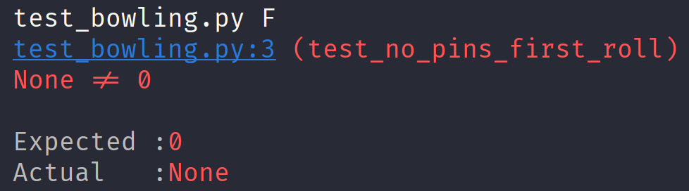

Katas in Python

### Considerations when writing a new test

* Test should test **one thing only**

* **Triangulate** by adding new tests that force you code to **pivot**

* Give tests **meaningful names (behavior/goal-oriented)** names that express your **business domain**

  - Avoid technical names like `myMethodReturns5`

  - Avoid leaking implementation information like `myTestReturnsFalse`

  - Avoid writing technical tests; you should test behaviours, not the technicality of components

* Make sure tests **fail for the right reason**

* Ensure you have **meaningful feedback from the failing** test

* Organize your unit tests to **reflect your production code**

### The Transformation Priority Premise

When we test drive an algorithm, the code usually changes from specific to generic; from stupid to intelligent.
We don't want to implement the whole algorithm all at once as there is a high chance to get stuck (**impasse**), 
distracted or tired, and by the time you implement the production code, you feel so drained 
you don't want to write any tests, delivering an implementation not supported by automated tests,
with a high chance to contain bugs (or unexpected use cases).

The Transformation Priority Premise is one of the technical terms introduced by Uncle Bob to 
formalize the phenomenon we experiment when test-driving production code, and it brings a sequence of
common changes from simple to complex that we unconsciously make through the process and
they can guide you when test-driving your code.

Note that the motivation for these transformations is always to make the code meet more generic specifications. 
They are very different from **refactors**, where you want to change the structure of the code to make it easier
to read or more simple without modifying the behavior.

### Avoid the impasse (or getting stuck)
Some problems are hard to solve all at once and it is very common for beginners to try to solve the whole problem with
a generic solution that ends up in a big buggy unmanageable chunk of code. It overloads your brain and there is a point
where you need to rewrite the whole implementation. 

The premise is that if you choose the tests and implementations that use transformations that are higher on the list, 
you will avoid the impasse. 
 
### The sequence of transformations

* (() –> None) no code at all->code that employs None
* (None -> constant)
* (constant->constant+) a simple constant to a more complex constant
* (constant->scalar) replacing a constant with a variable or an argument
* (statement->statements) adding more unconditional statements.
* (unconditional->if) splitting the execution path
* (scalar->list)
* (list->container)
* (statement->recursion)
* (if->while)
* (expression->function) replacing an expression with a function or algorithm
* (variable->assignment) replacing the value of a variable.


### An example in Python 

To validate this premise I want to put it into practice by resolving a Kata. The most used
Kata to illustrate this premise is "Roman Numerals" but I have solved this kata several times already and I would
like to use a different one: ** The bowling kata ** The requirements of this kata are very well explained in this
[Katalist by Codurance](https://katalyst.codurance.com/bowling).

#### 1. First baby step:

I would start by implementing my new function returning None as first step. We return None, which
is the top value in the transformation sequence:

```python
def score_for(all_rolls):
    return None
```

And implement a failing tests for a simple use case:

```python
def test_no_pins_first_roll():
    """
    Given no pins were knocked down on the first roll
    The score should be zero
    """
    assert score_for(all_rolls="0") == 0
```

For simplicity, I'm using a string type to represent a sequence of rolls.
This hides the concept of frame, but I am not worried about that yet because
I don't need to introduce that concept for now.

When there were no pins knocked down, we don't have any score point, and I am representing
that with a zero.

>
> Note how I am using the 'business' language right from the first test.
> This is important because it allows to bridge the communication between
> you, the developer, and any other domain expert (a bowling player or bowl center owner)
>

The test is failing ❌ and this is great! We always want to start with a failing test
that fails for the right reason and ensures our test cycle is healthy:



### 2. Fake it

We now want to make that test pass by faking the implementation. That is as simple as:

```python
def score_for(all_rolls):
    return 0
```

And we're now in transformation two (constant) and our test is passing ✅:


### 3. Next failing test

We know that if we test for two rolls with no pins `all_rolls="00"` the test will automatically pass so there
is no point on testing that, we need to find the next simplest case that fails and that could be `all_rolls="01"`


```python
def test_one_pin_second_roll():
    """
    Given one pin was knocked down on the second roll
    The score should be one
    """
    assert score_for(all_rolls="01") == 1
```
